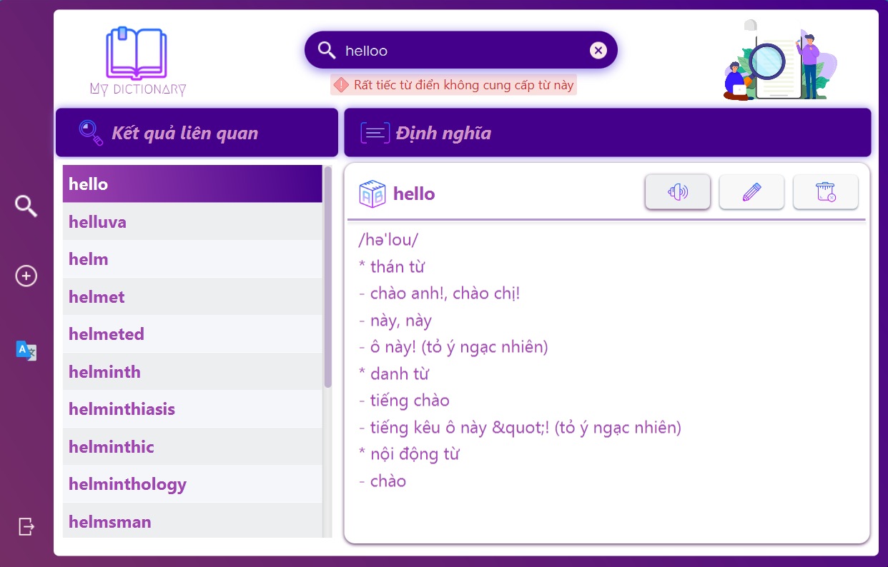

# Dictionary Application

## Contributors

- [Nguyễn Văn Hưng (20021370) - K65-T-CLC](https://github.com/hth125192)
- [Nguyễn Huỳnh Trà My (20020223) - K65-CA-CLC3](https://github.com/nhtm2702)
- [Hoàng Nguyễn Minh Trang (20020237) - K65-CA-CLC3](https://github.com/HoangTrang150302)

## Introduction

Bài tập lớn số 1 - Từ điển (UET OASIS - I2122 INT2204 24 - Lập trình hướng đối tượng)

## Features

- Thêm, sửa, xóa từ
- Tra từ
- Phát âm tiếng anh
- API google translate Anh <> Việt
- ...

## Technologies

- IntelliJ IDEA Community Edition 2021.2.1
- Scene Builder 17
- Java SE Development Kit 17
- JavaFX vesion 17.0.1
- CSS
- Maven Framework
- FreeTTS 1.2.2 Library
- Json-Simple 1.1.1 Library

## Guide

Run -> Edit Configurations... -> Add new run configuration... -> Application
- Main class: DictionaryApplication.App
- Name: App

Modify options -> Add VM options
- VM options: --module-path "\path\to\javafx-sdk-17.0.1\lib" --add-modules javafx.controls,javafx.fxml

## Preview

